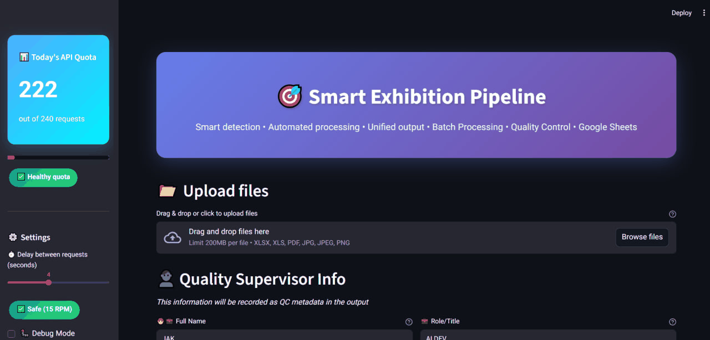

# 🧠 Dynamic OCR + QR Intelligence Suite

### 🚀 Smart Document Extraction, QR Decoding, Web Enrichment & Excel Integration

*By **Yabix** — AI-Powered Data Intelligence Platform*

---

## 📂 Project Structure

```
dynamic_ocr_qr/
│
├── app/
│   ├── __init__.py
│   ├── ocr_dyn.py          # OCR + Gemini JSON extractor (AI-based text & info extraction)
│   ├── qr_dyn.py           # Advanced QR detection & cleaning (multi-engine)
│   ├── mix_ocr_qr.py       # Merge OCR and QR data dynamically into unified JSON
│   ├── scrap.py            # Intelligent web scraper + Gemini web analyzer + translation
│   ├── excel_mode.py       # Excel-based enrichment, merging & deduplication
│   ├── final_mix.py        # Final integration: JSON + Excel into clean master dataset
│
├── streamlit_app/
│   └── app2.py             # Streamlit-based web interface for interactive use
│
├── data/
│   ├── input/              # Input files (images, PDFs, Excel sheets)
│   └── output/             # Processed and exported data
│
├── requirements.txt        # All Python dependencies
├── .gitignore              # Ignore caches, outputs, and private keys
├── LICENSE                 # Proprietary License
└── README.md               # (This file)
```

---

## ⚡ Overview

**Dynamic OCR + QR Intelligence Suite** by **Yabix** is an **AI-powered document automation system** that processes images, PDFs, and web data — combining **Optical Character Recognition (OCR)**, **QR code extraction**, and **AI-driven website analysis** into one intelligent workflow.

It automatically extracts structured data from scanned documents, decodes embedded QR links, enriches the data by crawling company websites, and delivers a clean, bilingual Excel output.

---

## 🧩 Core Functional Modules

### 🧠 1. `ocr_dyn.py`

> AI-based OCR using **Google Gemini SDK** to extract structured JSON data fields from scanned documents.

* Converts PDFs to images using `pdf2image`
* Sends image data to Gemini (`gemini-2.5-flash`)
* Extracts addresses, phones, company names, persons, and text
* Ensures schema-valid JSON output

📦 **Output:** `gemini_output.json`

---

### 🧾 2. `qr_dyn.py`

> Multi-engine QR code decoder with deep enhancement and smart URL validation.

* Uses **OpenCV, pyzbar, and ZXing** for detection
* Enhances images using CLAHE, sharpening, adaptive thresholding
* Supports rotated / low-quality / PDF-embedded QR codes
* Extracts and cleans URLs or vCard fields

📦 **Outputs:**

* Raw: `final_superqr_v6_raw.json`
* Cleaned: `final_superqr_v6_clean.json`

---

### 🔗 3. `mix_ocr_qr.py`

> Merges OCR and QR results into a single structured dataset.

* Aligns per-file/page results intelligently
* Merges OCR JSONs with corresponding QR URLs
* Handles PDFs with multiple pages

📦 **Output:** `mix_ocr_qr.json`

---

### 🌍 4. `scrap.py`

> Web crawler + Gemini-based AI analyzer + translation engine.

* Extracts URLs from `mix_ocr_qr.json`
* Crawls websites (multi-threaded) up to configurable depth
* Cleans HTML, extracts business info using Gemini
* Translates English fields to Persian (EN→FA)
* Smart SSL handling for domains
* Generates bilingual Excel report

📦 **Outputs:**

* `urls_clean.json`
* `gemini_scrap_output.json`
* `web_analysis.xlsx`

---

### 📊 5. `excel_mode.py`

> AI-driven Excel enrichment mode for bulk processing company URLs.

* Reads input Excel file containing URLs
* Crawls and analyzes content with Gemini
* Translates and merges into enriched dataset
* Handles duplicate merging and normalization

📦 **Output:** `output_enriched_<timestamp>.xlsx`

---

### 🧬 6. `final_mix.py`

> Final-stage integration for unified data output.

* Merges JSON & Excel datasets
* Deduplicates by domain, phone, email, or company name
* Normalizes Persian and English content
* Generates clean BI-ready Excel export

📦 **Output:** `merged_final_<timestamp>.xlsx`

---

### 💻 7. `streamlit_app/app2.py`

> Modern **Streamlit Web Interface** for interactive document automation.

* Upload images, PDFs, or Excel files
* Run full OCR/QR/Web pipeline directly in browser
* Monitor logs and processing in real-time
* View and download structured results

---

## 🧰 Setup & Installation

### 1️⃣ Clone Repository

```bash
git clone https://github.com/<your-username>/dynamic_ocr_qr.git
cd dynamic_ocr_qr
```

### 2️⃣ Create Virtual Environment

```bash
python -m venv venv
source venv/bin/activate     # macOS/Linux
venv\Scripts\activate        # Windows
```

### 3️⃣ Install Dependencies

```bash
pip install -r requirements.txt
```

### 4️⃣ Configure Environment

#### • Windows:

* Install **Poppler for Windows** → [Poppler Releases](https://github.com/oschwartz10612/poppler-windows/releases/)
* Set environment variable:

  ```bash
  setx POPPLER_PATH "C:\poppler\Library\bin"
  ```

#### • API Key:

Set your Google Gemini API key:

```bash
setx API_KEY "AIzaSyXXXXXX"
```

---

## 🚀 Run the System

### Full Automated Pipeline

```bash
python app/ocr_dyn.py
python app/qr_dyn.py
python app/mix_ocr_qr.py
python app/scrap.py
python app/final_mix.py
```

### Streamlit Web App

```bash
streamlit run streamlit_app/app2.py
```

---

## 📊 Output Files

| Stage | File                          | Description                         |
| ----- | ----------------------------- | ----------------------------------- |
| OCR   | `gemini_output.json`          | AI-extracted structured text        |
| QR    | `final_superqr_v6_clean.json` | Clean URLs from QR                  |
| Merge | `mix_ocr_qr.json`             | Unified JSON (OCR + QR)             |
| Web   | `web_analysis.xlsx`           | Web-enriched bilingual company data |
| Final | `merged_final_*.xlsx`         | Master deduplicated dataset         |

---

## ⚙️ Technologies

* 🧠 Google Gemini SDK (`google-genai`)
* 🖼 OpenCV, Pillow, Pyzbar, Pyzxing, Pdf2Image
* 🌍 Requests, BeautifulSoup4
* 🧾 Pandas, OpenPyXL
* 🚀 Streamlit
* 🧮 Multithreading & Smart SSL Handler

---

## 💡 Future Improvements

* [ ] Integrated Web Dashboard (with job tracking)
* [ ] Real-time Streamlit pipeline visualization
* [ ] Supabase / Firestore integration
* [ ] Auto-export to Google Sheets

---

## ⚖️ License

This project is licensed under a **Proprietary License**.
All rights reserved © 2025 **Yabix**.
Unauthorized copying, modification, or redistribution of any part of this software is strictly prohibited.
For commercial or enterprise licensing, please contact:
📧 [yasa.aidv@gmail.com](mailto:yasa.aidv@gmail.com)

---

## 🎥 Live Preview

Experience the Streamlit Web App in action 👇

**📘 English Interface**


**📗 Persian Interface**


<!-- Or use a GIF -->

<!--  -->

---

### ❤️ Developed by **Yabix**

> Intelligent Document Automation | AI-Powered Data Extraction | Web Intelligence

---

Would you like me to generate a **short GitHub-friendly top section** (with badges, logo, and quick demo GIF preview) that you can place at the start of this README for marketing presentation?
